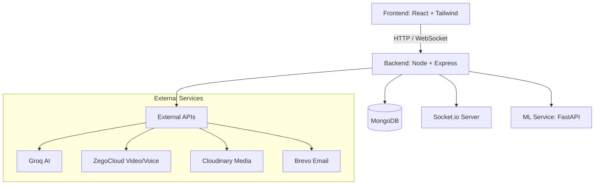

# PASO – Advanced Real-Time Chat Application

 PASO is a production-level real-time communication platform inspired by WhatsApp, enhanced with **Machine Learning capabilities**, **AI automation**, and full multimedia support. It integrates messaging, voice/video communication, intelligent moderation, and admin analytics into a complete chat ecosystem.

🚀 **[Live Demo](https://chat-app-sooty-mu.vercel.app)**

---

## 🏗️ Architecture

The application follows a decoupled micro-service inspired architecture to handle real-time sockets and ML processing efficiently.

